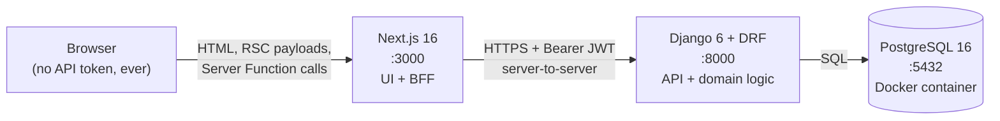
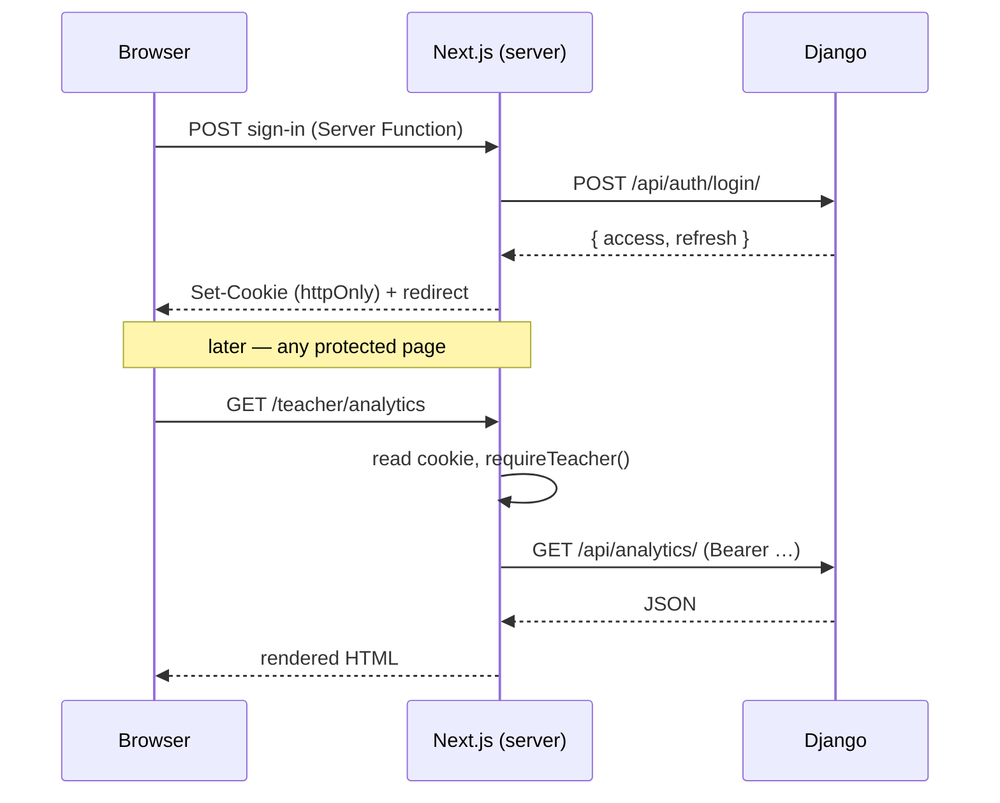

# Evalio — System Architecture

A broad map of how Evalio is put together. This document stays at the level of
"what talks to what, and why". For the detail of individual models, endpoints,
components and files, see [BACKEND.md](BACKEND.md) and [FRONTEND.md](FRONTEND.md).

---

## 1. What the system is

Evalio is a quiz platform for schools, built around one idea: **a student who gets
an answer wrong should be told why, in their teacher's own words.**

That single requirement shapes most of the architecture. It means the teacher has
to author an explanation per *wrong answer choice*, not per question; it means
those explanations must never leak to a student before they submit; and it means
a submitted attempt has to be immutable evidence of what was asked, even if the
teacher later edits the question.

There are exactly two kinds of human user:

| Role | What they do |
| --- | --- |
| **Teacher** | Builds question banks, assembles quizzes, manages class rosters, assigns quizzes, reads results and statistics |
| **Student** | Sees quizzes assigned to them, sits them once, reads their feedback afterwards |

There is no admin *role* in the application. Django's built-in superuser +
`/admin/` covers the few operations (creating teacher accounts) that need it.

---

## 2. The three processes

Evalio runs as three separate processes in development. Nothing is bundled
together; each can be restarted independently.



The important property of that diagram is the arrow that **does not exist**: the
browser never calls Django. See §4.

| Process | Technology | Owns |
| --- | --- | --- |
| Database | PostgreSQL 16, in Docker Compose | All persistent state |
| Backend | Django 6 (`>=6.0.6`), Django REST Framework, SimpleJWT | The domain model, all authorization, all scoring |
| Frontend | Next.js 16.2.12 (App Router), React 19, TypeScript 6, Tailwind CSS v4 | Rendering, and the session cookie |

---

## 3. Repository layout

```
evalio/
├── manage.py                 Django entry point
├── requirements.txt          Backend dependencies
├── docker-compose.yml        Postgres service (with a healthcheck)
├── env_example               Template for the backend .env
├── pyproject.toml            ruff configuration
│
├── evalio/                   Django project package (settings, root URLconf)
│
├── accounts/                 Custom User with a `role` field; register / login / me
├── quizzes/                  Topic, QuestionBank, Question, Choice, Quiz, QuizQuestion
├── classes/                  Class, Enrollment, TeachingGroup, GroupMembership, QuizAssignment
├── attempts/                 QuizAttempt, AnswerResponse — a student sitting a quiz
├── feedback/                 FeedbackResult + the feedback generation service
├── analytics/                Read-only. Owns no models; only ways of querying the others
│
├── scripts/devdb.py          One command to bring the database up, migrate and seed
├── seed_data/                JSON content for the bulk seeder (not a Django fixture)
│
├── frontend/                 The entire Next.js application
│   ├── app/                  App Router routes (teacher/, student/, login/, register/)
│   ├── components/           Shared React components, incl. the `ui/` primitives
│   ├── lib/                  Server-only API client, auth, types, Server Functions
│   └── proxy.ts              Next 16's middleware — token refresh + optimistic redirect
│
└── docs/                     This documentation
```

---

## 4. The Backend-For-Frontend pattern

**No JWT ever reaches JavaScript.** This is the single most consequential
architectural decision in the project, so it is worth stating plainly.

The conventional React + DRF setup stores the access token in `localStorage` and
attaches it from the browser. Evalio does not. Instead:

1. The browser signs in against a **Next.js Server Function**, not against Django.
2. That Server Function calls Django, receives `{access, refresh}`, and writes both
   into **`httpOnly` cookies**. `httpOnly` means `document.cookie` cannot see them,
   so no amount of injected script can exfiltrate a session.
3. Every subsequent page render happens on the Next.js server. It reads the cookie,
   attaches `Authorization: Bearer …`, and calls Django server-to-server.
4. The browser receives rendered HTML and RSC payloads. It never holds a credential.



`frontend/lib/api.ts` is the **only** module that talks to Django, and it is marked
`import "server-only"` so that pulling it into a client bundle is a build error
rather than a silent leak.

### Three layers of defence, on purpose

| Layer | File | What it actually guarantees |
| --- | --- | --- |
| Proxy redirect | `frontend/proxy.ts` | Only that *a cookie exists*. A forged value satisfies it. Cheap, runs on every request. |
| Page guard | `frontend/lib/auth.ts` | Asks Django who the bearer is. Real, but still client-side of the API. |
| API permissions | `quizzes/permissions.py` + every `get_queryset()` | The actual boundary. Django re-checks ownership on every request regardless of what the frontend believes. |

Deleting `proxy.ts` would cost a redirect, not security.

---

## 5. The domain model at a glance

```mermaid
erDiagram
    User ||--o{ Topic : creates
    Topic ||--o{ QuestionBank : contains
    QuestionBank ||--o{ Question : contains
    Question ||--o{ Choice : has
    Topic ||--o{ Quiz : contains
    Quiz }o--o{ Question : "QuizQuestion (ordered)"

    User ||--o{ Class : creates
    Class ||--o{ Enrollment : has
    User ||--o{ Enrollment : "is enrolled via"
    Class ||--o{ TeachingGroup : "subdivides into"
    TeachingGroup ||--o{ GroupMembership : has
    Enrollment ||--o{ GroupMembership : "is a member via"

    Quiz ||--o{ QuizAssignment : "is assigned by"
    QuizAssignment }o--o| Class : "…to a class"
    QuizAssignment }o--o| TeachingGroup : "…or a group"
    QuizAssignment }o--o| User : "…or one student"

    User ||--o{ QuizAttempt : sits
    Quiz ||--o{ QuizAttempt : "is sat as"
    QuizAttempt ||--o{ AnswerResponse : contains
    QuizAttempt ||--|| FeedbackResult : "is scored into"
```

Four structural decisions worth knowing before reading any code:

**Questions are shared by reference.** A `Question` lives in a `QuestionBank` and is
pulled into any number of quizzes through the `QuizQuestion` join table. Editing it
changes every quiz that uses it. That is the point — banks exist to be reused — but
it creates the next problem.

**Answers are snapshots.** Because questions are shared and editable,
`AnswerResponse` copies the question text, the chosen choice's text, and that
choice's explanation onto itself at answer time. Both foreign keys are `SET_NULL`.
A teacher rewriting a question next term cannot retroactively change what a student
appears to have been asked, and deleting a question cannot delete their work.

**A quiz reaches students by exactly one of three routes.** `QuizAssignment` has
three nullable foreign keys — class, group, or individual student — with a database
`CheckConstraint` enforcing that exactly one is set. This is deliberately not a
`GenericForeignKey`: a GFK cannot be joined in SQL, so "which quizzes are assigned
to me" would become application-level fan-out.

**Group membership points at enrolment, not at the student.** `GroupMembership`
links to an `Enrollment` row rather than to a `User`. That makes "a group member is
enrolled in the group's class" a structural guarantee rather than a validation rule
someone can forget.

---

## 6. The two flows that matter

### Teacher: author → assemble → assign → read

```
Topic  →  QuestionBank  →  Question (+ Choices, each with an explanation)
                                │
                                ▼
                            Quiz (ordered selection of questions)
                                │
                       publish ─┤
                                ▼
                          QuizAssignment  →  class / group / student
                                │
                                ▼
                     Results screen  ·  Statistics screen
```

### Student: see → sit → submit → learn

```
Assigned quizzes  →  start attempt  →  answer each question  →  submit
                          │                    │                    │
                     one attempt          saved as you go,      scoring +
                     per quiz, ever       correctness withheld  feedback generated
                                                                     │
                                                                     ▼
                                                            Feedback passage
```

`POST /api/attempts/<id>/answer/` deliberately does **not** report whether the
answer was right. Doing so would hand the student the answer key mid-quiz. They
find out at submit time, together with the explanation.

---

## 7. Cross-cutting invariants

These hold across the whole system. Each is enforced in code and covered by tests.

**The answer key never reaches a student.** `Choice.is_correct` and
`Choice.feedback_text` are absent from every student-facing serializer. The
snapshot fields on `AnswerResponse` are likewise absent from
`AnswerResponseSerializer`. On the frontend, the TypeScript student types carry
`?: never` members so that passing a teacher-shaped object where a student shape is
expected is a **compile error** (`frontend/lib/types.guard.ts`).

**Another user's row is a 404, not a 403.** Every teacher-facing queryset filters
to rows the requesting teacher owns *before* `get_object()` runs. A 403 would
confirm the row exists.

**One attempt per student per quiz.** Enforced in `StartAttemptView`. An *open*
attempt is returned so a refresh mid-quiz resumes; a *submitted* one answers `409`
with the existing attempt id, so the client can redirect to the result rather than
show an error.

**Every list response is paginated.** DRF `PageNumberPagination`, page size 25, so
list responses are `{count, next, previous, results}` — never a bare array. A small
number of endpoints are deliberately unpaginated (`/results/`, `/audience/`,
`/analytics/`) because they compute means and distributions over a whole set, and a
statistic computed over page 1 would be false.

**Student visibility flows through one selector.**
`quizzes/selectors.py::quizzes_assigned_to` is the single definition of which
quizzes a student may see, used by the quiz list, the quiz detail, and the
attempt-start authorization check. Its inverse, `assignment_audience`, answers "who
does this quiz reach" for the teacher's assign and results screens. A test asserts
the two agree on the same student set.

---

## 8. Where the scoring happens

Scoring lives entirely in the backend, in one function:
`feedback/services.py::generate_feedback`.

On submit, it walks the quiz's questions in order, counts correct answers, and
collects the teacher-written explanation attached to each *wrong* choice the
student picked. Those explanations are stitched into a single passage with linking
words ("Also,", "On top of that,") so the result reads as prose rather than as a
list of disconnected sentences. It writes one `FeedbackResult` per attempt.

Two behaviours are deliberate: a question the student never answered counts against
the score but contributes no explanation (there is no chosen choice to explain), and
a wrong answer whose choice has a blank explanation is skipped rather than padded
with filler.

Critically, the explanations come from the **snapshot** on `AnswerResponse`, not
from the live `Choice`. Re-running the function after a teacher edits the question
rebuilds the same passage the student originally received.

---

## 9. Reserved — LLM-generated feedback

> **This section is intentionally left blank.**
>
> Replacing or augmenting the hand-authored feedback passage with LLM-generated
> feedback is the next major piece of work. This space is reserved for its
> system-level design: where the model is called from, what data crosses that
> boundary, how failure and latency are handled, and how the existing
> deterministic path is preserved as a fallback.
>
> For orientation, the seam is narrow and already isolated:
> `feedback/services.py::generate_feedback` is the only function that produces a
> `FeedbackResult`, and it is called from exactly one place —
> `attempts/views.py::SubmitAttemptView`.
>
> _To be written._

---

## 10. Known constraints and simplifications

Honest limits of the current design, so nobody mistakes them for oversights:

- **Single-teacher ownership.** A `Class` belongs to the teacher who created it.
  Two teachers who both teach 5B each get their own row. Sharing a cohort across
  teachers would need a `School` model and an admin role.
- **No retakes.** One attempt per student per quiz, permanently. Allowing a second
  attempt needs retake UI and an attempt history to go with it, or a teacher's
  recorded score would be silently overwritten.
- **Teacher accounts are created out-of-band.** Public registration always creates
  a student; teachers are made with `createsuperuser` plus the Django admin.
- **Student search is narrow by design.** A teacher can only search students already
  enrolled in one of their classes. Reaching a brand-new account requires their
  *exact* username via `POST /api/enrollments/invite/`. This is what stops a teacher
  account enumerating the student table.
- **CORS is transitional.** `django-cors-headers` still allows `localhost:3000`.
  Under the BFF the browser never calls Django directly, so once nothing depends on
  it the setting and the package can be removed rather than tightened.

---

## 11. Where to go next

| You want to… | Read |
| --- | --- |
| Get it running on a clean machine | [SETUP.md](SETUP.md) |
| Understand a model, endpoint or permission | [BACKEND.md](BACKEND.md) |
| Understand a screen, component or data-fetching decision | [FRONTEND.md](FRONTEND.md) |
| Know which frontend screen calls which endpoint | [FRONTEND.md § API map](FRONTEND.md#7-frontend--backend-map) |
